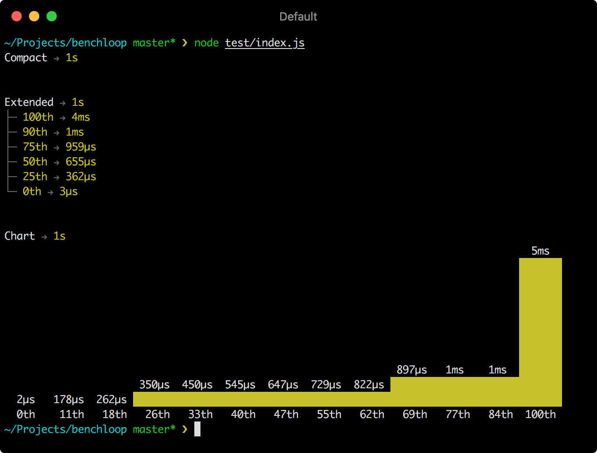

# Benchloop

<p align="center">
  
</p>

Simple benchmarking library with a pretty output.

## Install

```sh
npm install --save-dev benchloop
```

## Usage

The following interface is provided:

```ts
type LogType = 'extended' | 'compact' | false;

type Hook<CTX> = ( ctx: CTX ) => void;
type HookAfter<CTX, DATA> = ( ctx: CTX, data: DATA ) => void;

type ProfileOptions<CTX> = {
  name: string,
  iterations: number,
  log: LogType,
  groups: string[],
  only: boolean,
  skip: boolean,
  special: boolean,
  before: Hook<CTX>,
  beforeEach: Hook<CTX>,
  after: HookAfter<CTX, ProfileData<CTX>>,
  afterEach: Hook<CTX>,
  ctx: () => CTX,
  fn: ( ctx: CTX, iteration: number ) => void
};

type ProfileData<CTX> = {
  options: ProfileOptions<CTX>,
  iterations: number,
  elapsed: number,
  profiles: number[]
};

function benchloop<CTX = any> ( options: Partial<ProfileOptions<CTX>> | ProfileOptions<CTX>['fn'] ): void;
function group ( group: string, fn: Function ): void;

benchloop.only = benchloop;
benchloop.skip = benchloop;
benchloop.group = group;
benchloop.group.only = group;
benchloop.group.skip = group;

benchloop.defaultOptions: Options;
```

You can use this library like so:

```ts
import benchloop from 'benchloop';

benchloop ({
  name: 'Example benchmark',
  fn: () => {
    for ( let i = 0, l = 100000 * Math.random (); i < l; i++ ) {
      Math.exp ( i, 10 );
    }
  }
});

benchloop.group ( 'MyGroup', () => { // Group multiple benchmarks together

  benchloop ({
    name: 'Regular benchmark',
    fn: () => {}
  });

  benchloop.skip ({ // Skip this benchmark
    name: 'Skipped benchmark',
    fn: () => {}
  });

  benchloop.only ({ // Execute only this benchmark
    name: 'Only benchmark',
    fn: () => {}
  });

});

benchloop.summary (); // Display a summary
```

Multiple kinds of outputs are supported, the screenshot above is the result of running [this](./test/index.js).

The `benchloop` and `benchloop.group` functions support the optional `only` and `skip` methods, useful for quickly running benchmarks selectively.

## License

MIT © Fabio Spampinato
